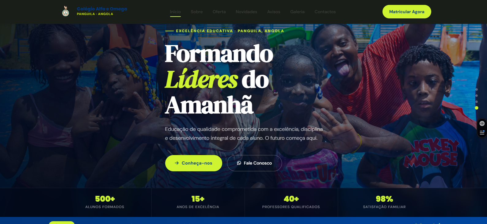

# 🏫 Website Oficial & Sistema de Gestão - Colégio Alfa e Omega

  

Este é o repositório oficial do **Colégio Alfa e Omega**, transformado numa plataforma interativa que une o marketing institucional à inteligência de dados pedagógicos. O sistema agora inclui um **Monitor Escolar** para análise de engajamento dos encarregados.

## 🚀 Tecnologias & Stack "Data-Driven"
* **Frontend:** HTML5, CSS3 (Modern Flexbox/Grid), JavaScript (Vanilla ES6+).
* **Backend & Serverless:** [Vercel](https://vercel.com) (Hospedagem e Deploy Contínuo).
* **Banco de Dados Real-time:** [Supabase](https://supabase.com) (PostgreSQL) para captura de leads e métricas.
* **Visualização de Dados:** Chart.js (Gráficos dinâmicos na Dashboard).
* **Domínio:** [colegioalfaeomega.com](https://www.colegioalfaeomega.com).

## 📊 Novas Funcionalidades (Versão 2.0)
* **Quiz de Performance do Encarregado:** Teste interativo que classifica o acompanhamento familiar (Bronze, Prata, Ouro, Exemplar).
* **Dashboard Administrativa:** Painel restrito para a Direção com métricas de visitas, cliques em medalhas e conversão de leads.
* **Rastreio de Eventos:** Monitoramento de cliques nas medalhas das Olimpíadas para medir o interesse dos pais.

## 📂 Estrutura de Pastas Atualizada
* `/assets/js/`: Scripts globais e lógica de integração com a API do Supabase.
* `/assets/css/`: Estilos do site e o novo **Dark Mode** da Dashboard.
* `/admin.html`: Portal de gestão e visualização de métricas em tempo real.
* `/quiz.html`: Interface de gamificação para os encarregados de educação.

## 🛠 Guia de Manutenção & Performance

### 1. Gestão de Dados (Supabase)
As chaves de API estão configuradas no frontend com **Row Level Security (RLS)** ativa, garantindo que usuários externos apenas enviem dados (INSERT) e apenas o administrador possa visualizar (SELECT).

### 2. Otimização de Imagens
Para garantir que os pais em Angola (com conexões variáveis) acedam rapidamente:
* **Formato:** Preferencialmente `.webp` ou `.jpg` otimizado.
* **Compressão:** Usar `Squoosh.app` para manter fotos abaixo de 300KB.

### 3. Workflow de Atualização
Sempre que houver novas medalhas ou eventos:
1.  Atualizar o arquivo `olimpiadas.html`.
2.  Garantir que os novos elementos possuam o gatilho `trackMedalInteraction()` para alimentar a Dashboard.
3.  Executar `git push` para deploy automático na Vercel.

## 🌐 Configuração de Domínio
O domínio oficial está configurado via **Vercel DNS**.
* **Tipo A:** `76.76.21.21` (@)
* **CNAME:** `cname.vercel-dns.com` (www)

---
**Arquiteto do Sistema:** Telsio Isidoro (IT Professional & Full-Stack Developer)
*Foco em transformar dados escolares em decisões pedagógicas.*
